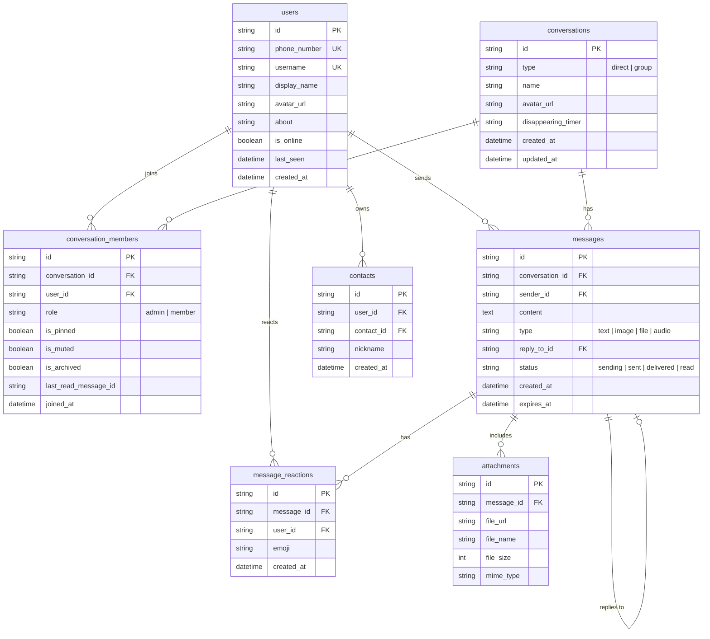

# Signal Web Clone — Secure Fullstack Messaging Platform

A fullstack clone of the **Signal Messenger** application replicating Signal's privacy-focused design, desktop user experience, and real-time messaging workflows.

Built as part of the **SDE Fullstack Assignment**, strictly structured into [`frontend/`](./frontend) and [`backend/`](./backend).

---

## 🌟 Highlights & Features

### 1. Pixel-Faithful Signal Desktop UX
- **Authentic Theme & Typography**: Signal's exact dark palette (`#121212`, `#1b1b1b`, `#2c6bed`), typography, and iconography extracted directly from `Signal-Desktop`.
- **"Show Tabs" & "Hide Tabs" (`NavTabsToggle`)**: Replicated Signal Desktop's collapsible navigation bar with the hamburger menu icon (`menu.svg`), unread badges, and desktop shortcut (`Ctrl+Shift+T` / `Alt+T`).
- **Message Bubbles & Tails**: Distinct outgoing blue bubbles and incoming dark bubbles, auto-scrolling, date dividers ("Today", "Yesterday"), and end-to-end encryption security banner.
- **Safety Number Verification**: Full 60-digit fingerprint comparison grid, scannable QR code generator, and "Mark as Verified" status.
- **Audio & Video Calling Overlays**: Interactive calling modal with ringing states, duration counters, mute, camera toggle, and Picture-in-Picture mode.

### 2. Authentication & Onboarding (Core Requirement 1)
- **Phone / Identifier Login & Registration**: Signal-style onboarding screen supporting phone number verification.
- **Fixed OTP Verification**: Mock verification code `123456` with 6-digit auto-advancing input fields.
- **Profile Customization**: Set display name, username, and profile avatar during onboarding or later in Settings.
- **Session Persistence**: JWT token saved in client storage, persisting login across page reloads.
- **Log Out**: Accessible via Settings (`Preferences` ➔ `Log Out`) with a confirmation dialog.
- **Demo Quick-Fill Buttons**: One-click quick-fill buttons for demo accounts (Pratham, Sarah Connor, Alex Miller, Elena Rostova) for rapid interview evaluation.

### 3. Group Messaging & Contact Management
- **Group Chats**: Create group conversations with custom names and member selection.
- **Admin Controls**: Creator automatically designated as group admin; add and remove members with database persistence.
- **Conversation List**: Universal search across contacts and messages, filter pills (`All` / `Unread`), pinned chats sorted to top, mute, and right-click context menus.

### 4. Bonus Features
- 📎 **Media & File Attachments**: File uploader with automatic MIME type detection and static file serving.
- ❤️ **Emoji Reactions**: Hover action tray to add/remove emoji reactions in real time.
- 💬 **Quoted Replies**: Signal-styled reply previews linked to parent messages.
- ⏱️ **Disappearing Messages**: Functional timer dropdown (Off, 30s, 5m, 1h, 1d, 1w, 4w).
- ⌨️ **Keyboard Shortcuts**: `Enter` to send, `Shift+Enter` for multiline, `Ctrl+Shift+T` to toggle navigation tabs.

---

## 🏗️ Architecture & Decoupling

The frontend communicates with the backend through an abstract service interface ([`ISignalService`](./frontend/src/services/ISignalService.ts)), completely decoupling UI presentation from network protocols:

```
┌────────────────────────────────────────────────────────┐
│               Frontend: Next.js + React                │
│    (Zustand Stores: useChatStore, useSettingsStore)    │
└───────────────────────────┬────────────────────────────┘
                            │
              ISignalService Contract Layer
             (RealSignalService / MockSignalService)
                            │
            ┌───────────────┴───────────────┐
            │                               │
       HTTP REST API                    WebSockets
  (http://localhost:8000/api)     (ws://localhost:8000/ws/{uid})
            │                               │
┌───────────┴───────────────────────────────┴────────────┐
│              Backend: Python FastAPI Server            │
│         (Uvicorn + ConnectionManager + JWT)            │
└───────────────────────────┬────────────────────────────┘
                            │
                     SQLAlchemy ORM
                            │
┌───────────────────────────┴────────────────────────────┐
│               SQLite Database (signal.db)              │
│       7 Relational Tables + Foreign Key Constraints    │
└────────────────────────────────────────────────────────┘
```

---

## 🗄️ Database Schema Design (SQLite)

The database schema is designed with proper relational normalization, foreign key constraints, and cascade policies:



---

## 🔌 API Specification

### Authentication (`/api/auth`)
| Method | Endpoint | Description |
| :--- | :--- | :--- |
| `POST` | `/api/auth/register` | Register new user with phone & display name |
| `POST` | `/api/auth/login` | Mock OTP request (returns standard test code `123456`) |
| `POST` | `/api/auth/verify-otp` | Verify OTP and receive JWT access token |
| `GET` | `/api/auth/me` | Fetch active user profile |
| `PUT` | `/api/auth/me` | Update display name, username, avatar, or about bio |
| `GET` | `/api/auth/users` | List all registered users (for contact picker & profile switcher) |
| `POST` | `/api/auth/switch/{user_id}` | Quick switch active session user |

### Conversations (`/api/conversations`)
| Method | Endpoint | Description |
| :--- | :--- | :--- |
| `GET` | `/api/conversations` | List user's conversations with unread count and last message |
| `GET` | `/api/conversations/{id}` | Get conversation metadata & participant list |
| `POST` | `/api/conversations/direct` | Start or open existing 1-on-1 direct chat |
| `POST` | `/api/conversations/group` | Create group chat with custom name and member IDs |
| `PATCH` | `/api/conversations/{id}` | Update pin, mute, archive, disappearing timer, or name |
| `POST` | `/api/conversations/{id}/members` | Add user to group |
| `DELETE` | `/api/conversations/{id}/members/{uid}` | Remove user from group |
| `DELETE` | `/api/conversations/{id}` | Delete conversation |

### Messages (`/api/conversations/{id}/messages` & `/api/messages`)
| Method | Endpoint | Description |
| :--- | :--- | :--- |
| `GET` | `/api/conversations/{id}/messages` | Get all messages in thread |
| `POST` | `/api/conversations/{id}/messages` | Send message (text/attachments/reply) & broadcast via WS |
| `POST` | `/api/conversations/{id}/read` | Mark all thread messages as read & notify sender |
| `DELETE` | `/api/messages/{id}` | Delete message for everyone |
| `POST` | `/api/messages/{id}/reactions` | Toggle emoji reaction & broadcast via WS |

### Real-Time WebSockets (`/ws/{user_id}`)
- Connect to `ws://localhost:8000/ws/{user_id}`.
- Handles real-time events:
  - `message_received`: New incoming message.
  - `message_status`: Delivery status changes (`sent`, `delivered`, `read`).
  - `message_reaction`: Real-time reaction update.
  - `typing_status`: When a contact starts or stops typing.
  - `presence`: Online/offline presence changes.

---

## 🚀 Local Setup & Installation

### Prerequisites
- **Node.js**: v18+ (tested on Node v20/v22)
- **Python**: v3.10+ (tested on Python 3.13)

### 1. Start Backend (FastAPI)
```bash
cd backend
python -m venv .venv

# On Windows:
.venv\Scripts\activate
# On macOS/Linux:
source .venv/bin/activate

pip install -r requirements.txt

# Seed the SQLite database with realistic Signal contacts and chats:
python -m app.seed

# Run the FastAPI server:
uvicorn app.main:app --reload --port 8000
```
Backend will be available at:
- REST API: `http://localhost:8000`
- Interactive Swagger UI Docs: `http://localhost:8000/docs`
- WebSocket Server: `ws://localhost:8000/ws/{userId}`

### 2. Start Frontend (Next.js)
```bash
cd frontend
npm install
npm run dev
```
Frontend will be available at:
- Web Application: `http://localhost:3000`

---

## 👥 How to Test Multi-User Messaging

1. Open **`http://localhost:3000`** in a regular browser window (logged in as **Pratham** by default).
2. Open **`http://localhost:3000`** in an **Incognito / Private window** (or second browser).
3. In the second window, click the avatar in the sidebar and switch to **Sarah Connor**.
4. Open the conversation with **Sarah Connor** in Window 1 and send a message.
5. **Notice in Window 2**:
   - The message arrives instantly via WebSockets with an audio notification sound.
   - Window 1 shows the single check `✓` (sent) immediately turn into double check `✓✓` (delivered).
   - In Window 2, click into the chat to view it: Window 1 checkmarks immediately turn **blue** (`✓✓` read).
   - Type in the input in Window 2: Window 1 displays the animated typing indicator.
   - Click an emoji reaction on any bubble in Window 2: Window 1 updates the emoji reaction badge in real time.
6. Click the hamburger icon at the top of the sidebar to test **"Hide tabs"** and **"Show tabs"** (or press `Ctrl+Shift+T`).

---

## 🧪 Automated Testing

To run the automated backend test suite:
```bash
cd backend
.venv\Scripts\python test_api.py
```
To run frontend type-checking and production build verification:
```bash
cd frontend
npx tsc --noEmit
npm run build
```

