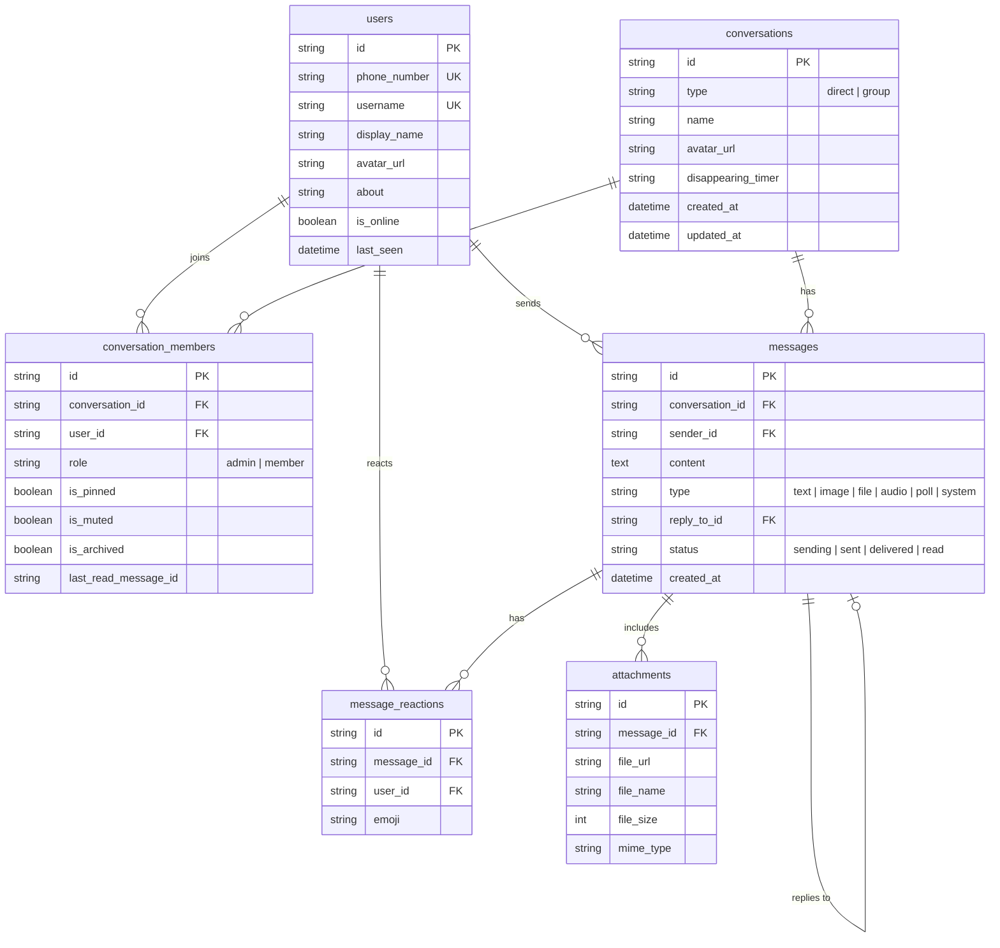

# Signal Web Clone — Secure Fullstack Messaging Platform

A fullstack clone of the **Signal Messenger** application replicating Signal's privacy-focused design, desktop user experience, real-time messaging, and interactive group features.

Built as part of the **SDE Fullstack Assignment**, strictly structured into [`frontend/`](./frontend) and [`backend/`](./backend).

---

## 🌟 Highlights & Key Features

### 1. Pixel-Faithful Signal Desktop UX
- **Authentic Theme & Typography**: Signal's exact dark palette (`#121212`, `#1b1b1b`, `#2c6bed`), typography, and iconography extracted directly from Signal Desktop.
- **"Show Tabs" & "Hide Tabs" (`NavTabsToggle`)**: Replicated Signal Desktop's collapsible navigation bar with the hamburger menu icon (`menu.svg`), unread badges, and desktop shortcut (`Ctrl+Shift+T` / `Alt+T`).
- **Message Bubbles & Alignment**: Distinct outgoing blue bubbles on the right and incoming dark bubbles on the left, auto-scrolling, date dividers ("Today", "Yesterday"), and end-to-end encryption security banner.
- **Appearance Settings**: Theme dropdown selector (`Dark`, `Light`, `System`) and Language options matching Signal Desktop preferences.

### 2. Interactive Polls & Ended Polls Flow
- **Create Poll Modal**: Set question, dynamic options, and toggle *Allow multiple votes* with instant WebSocket broadcasting.
- **Real-Time Poll Voting**: Live option percentage progress bars, voter counts, checkmarks, and deduplicated real-time state updates across connected clients.
- **Ended Poll UI & System Notice**:
  - Creator-only poll ending permission.
  - System notice: `You ended the poll: <question>` with an interactive `View poll` pill button.
  - Subtitle updates to `Poll · Final results` with white checkmark badges (`✓ 1`) on voted options and light pill `View votes` button.
- **Poll Details Modal**: Displays detailed voter lists with avatars, display names, and total vote count (`★ 1 vote`).

### 3. Authentication & Onboarding
- **Phone / Identifier Login & Registration**: Signal-style onboarding screen supporting phone number verification.
- **Fixed OTP Verification**: Verification code `123456` with 6-digit auto-advancing input fields.
- **Profile Customization**: Set display name, username, and profile avatar during onboarding or in Settings.
- **Session Persistence**: JWT token saved in client storage, persisting login across page reloads.
- **Log Out**: Accessible via Settings (`Preferences` ➔ `Log Out`) with confirmation dialog.

### 4. Group Messaging & Contact Management
- **Group Chats**: Create group conversations with custom names, camera badge avatar upload, and member selection (`Choose members` & `Name this group`).
- **Admin Controls**: Creator designated as admin; add and remove members with database persistence.
- **Conversation List**: Universal search across contacts and messages, filter pills (`All` / `Unread`), pinned chats sorted to top, mute, and right-click context menus.

### 5. Attachments, Reactions & Disappearing Messages
- 📎 **Media & File Attachments**: Attachment popover menu (*Photos & Videos*, *File*, *Poll*) with downward triangle caret pointing at `+`.
- ❤️ **Emoji Reactions**: Hover action tray to add/remove emoji reactions in real time.
- 💬 **Quoted Replies**: Signal-styled reply previews linked to parent messages.
- ⏱️ **Disappearing Messages**: Functional timer dropdown (Off, 30s, 5m, 1h, 1d, 1w, 4w).

---

## 🏗️ Architecture & Decoupling

The frontend communicates with the backend through an abstract service interface ([`ISignalService`](./frontend/src/services/ISignalService.ts)), completely decoupling UI presentation from network protocols:

```
┌────────────────────────────────────────────────────────┐
│               Frontend: Next.js + React                │
│    (Zustand Stores: useChatStore, useSettingsStore)    │
└───────────────────────────┬────────────────────────────┘
                            │
              ISignalService Contract Layer
             (RealSignalService / MockSignalService)
                            │
            ┌───────────────┴───────────────┐
            │                               │
       HTTP REST API                    WebSockets
  (http://localhost:8000/api)     (ws://localhost:8000/ws/{uid})
            │                               │
┌───────────┴───────────────────────────────┴────────────┐
│              Backend: Python FastAPI Server            │
│         (Uvicorn + ConnectionManager + JWT)            │
└───────────────────────────┬────────────────────────────┘
                            │
                     SQLAlchemy ORM
                            │
┌───────────────────────────┴────────────────────────────┐
│               SQLite Database (signal.db)              │
│       7 Relational Tables + Foreign Key Constraints    │
└────────────────────────────────────────────────────────┘
```

---

## 🗄️ Database Schema Design (SQLite)



---

## 🚀 Local Setup & Installation

### Prerequisites
- **Node.js**: v18+ (tested on Node v20/v22)
- **Python**: v3.10+ (tested on Python 3.13)

### 1. Start Backend (FastAPI)
```bash
cd backend
python -m venv .venv

# On Windows:
.venv\Scripts\activate
# On macOS/Linux:
source .venv/bin/activate

pip install -r requirements.txt

# Seed SQLite database:
python -m app.seed

# Run FastAPI server:
uvicorn app.main:app --reload --port 8000
```
- REST API: `http://localhost:8000`
- API Docs: `http://localhost:8000/docs`
- WebSocket Server: `ws://localhost:8000/ws/{userId}`

### 2. Start Frontend (Next.js)
```bash
cd frontend
npm install
npm run dev
```
- Web App: `http://localhost:3000`

---

## 🌐 Deployment (Vercel & Render)

### 🛠️ Backend Deployment on Render (FastAPI)
1. Create a **Web Service** on [Render](https://dashboard.render.com/) connected to repository `PrathamC0DES/signal-clone`.
2. Configure settings:
   - **Root Directory**: `backend`
   - **Runtime**: `Python 3`
   - **Build Command**: `pip install -r requirements.txt`
   - **Start Command**: `uvicorn app.main:app --host 0.0.0.0 --port $PORT`

### 🚀 Frontend Deployment on Vercel (Next.js)
1. Import repository `PrathamC0DES/signal-clone` on [Vercel](https://vercel.com/new).
2. Set **Root Directory** to `frontend`.
3. Set Environment Variables:
   - `NEXT_PUBLIC_API_URL`: `https://<your-render-app>.onrender.com/api`
   - `NEXT_PUBLIC_WS_URL`: `wss://<your-render-app>.onrender.com/ws`

---

## 🧪 Testing & Code Quality

```bash
# Frontend TypeScript check
cd frontend
npx tsc --noEmit

# Backend API test suite
cd backend
python test_api.py
```
